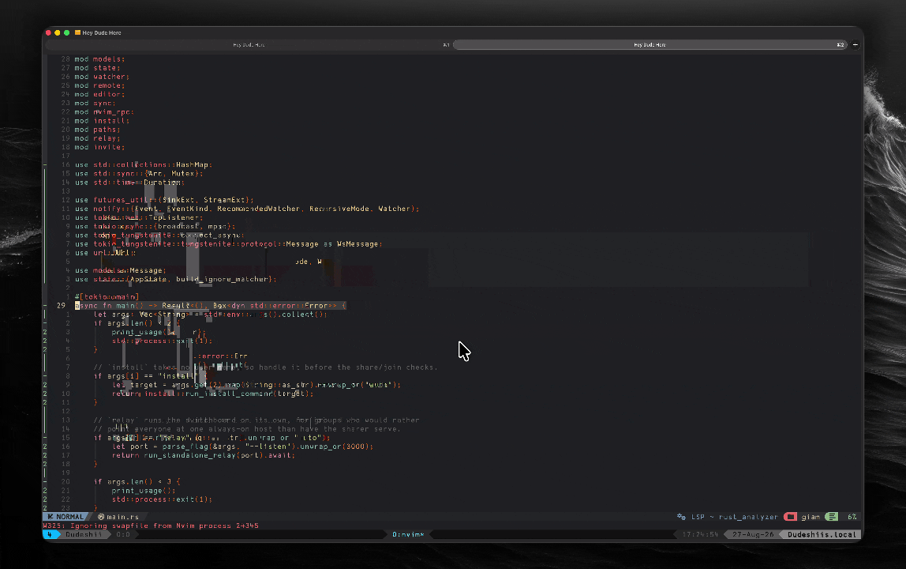

# askia.nvim

[](https://github.com/Dudeiebot/askia.nvim/actions/workflows/test.yml)

**Ask [Claude Code](https://claude.com/claude-code) about your code, from inside
Neovim — without letting it change a line.**

askia hands Claude read-only tools. It can grep for callers and follow a type
definition to answer you properly, but it cannot write to your working tree. No
diff to review, no edit to undo, no agent loose in your repo. And you watch
every file it opens.



Park the cursor inside a function and run `:Ask`. The answer streams into a
floating window.

```
:Ask                                       the function under the cursor
:Ask why is this taking self by value?     ... with a question
:'<,'>Ask what breaks if this is nil?      ... about a visual selection
:%Ask summarise this module                ... about the whole file
:AskToggle                                 put it away / bring it back
```

You see the tools it reaches for:

```
> what does shout() do to the output, and where is it defined?

⏺ Grep(function shout|shout\s*=)
⏺ Read(src/greeter.lua)
`shout()` uppercases the string and appends "!" (greeter.lua:3-5). So
`shout(out)` turns "hello <name>" into "HELLO <NAME>!", which is what gets
printed — but note `out` itself is what's returned from `greet`.
```

## Ask about code that spans files

The question you actually have is usually not about one function. It's about
how *this* one relates to one somewhere else.

`:AskAdd` attaches the function under the cursor — or a visual range — to your
next question. Mark as many as you like, across as many files as you like, then
ask:

```
in greet.c:      :3,6AskAdd          → 1 reference
in config.lua:   :AskAdd             → 2 references
in greeter.lua:  :Ask do these agree about what they return?
```

All three arrive together, each labelled with its file and line range, so Claude
answers from the code rather than going looking for it. Ranges are tracked with
extmarks — edit a file after marking something and the *same lines* are still
sent, not the same line numbers. [More on references](#references).

## Requirements

- Neovim 0.10+ (`vim.system`, `vim.uv`)
- `claude` on your `$PATH`, already authenticated
- A treesitter parser for the language, if you want `:Ask` to find the
  enclosing function on its own. Without one, select a range first.

askia is a front-end, not a provider. It shells out to the `claude` CLI you have
already installed, and every `:Ask` is billed to your existing Claude Code plan
like any other Claude Code call. That is the trade for it being a few hundred
lines of Lua with no API keys of its own to manage — if you don't use Claude
Code, this plugin has nothing for you.

Inside the answer window:

| key | |
| --- | --- |
| `<CR>` | follow-up question, typed at the bottom of the window |
| `y` | yank the answer |
| `t` | continue in an interactive claude session |
| `q` | hide it — `:AskToggle` brings it back |
| `Q` | quit and discard |
| `+` `-` | taller / shorter |
| `>` `<` | wider / narrower |
| `M` | maximize (toggle) |
| `=` | back to the configured size |
| `<C-c>` | cancel the request in flight |
| `?` | show this list |

`q` only hides — `:AskToggle` brings the window back with the conversation
intact, so you can duck out to look at the code and come back. Asking something
new replaces that window, hidden or not: each question gets a clean window,
while the conversation itself carries on in the session. An answer still
streaming keeps streaming while hidden, and you get a nudge when it lands. `Q`
(or `:AskClose`) is the real quit: it stops anything in flight and throws the
answer away.

The window opens at the size you configure and stays there. Resize by hand with
the keys above — that sticks for later answers until you press `=`. If you'd
rather it fit each answer, `window.auto_height = true` treats `window.height` as
a ceiling it grows into instead, with the top edge pinned so text doesn't jump
while it streams.

## Install

**lazy.nvim**

```lua
{
  "Dudeiebot/askia.nvim",
  cmd = { "Ask", "AskFollow", "AskCancel" },
  keys = {
    { "<leader>aa", ":Ask<CR>", mode = { "n", "x" }, silent = true, desc = "Ask Claude" },
    { "<leader>at", "<cmd>AskToggle<cr>", desc = "Toggle the Claude answer" },
  },
  opts = {},
}
```

**packer.nvim**

```lua
use({ "Dudeiebot/askia.nvim" })
```

**vim-plug**

```vim
Plug 'Dudeiebot/askia.nvim'
```

Calling `setup()` is optional — the commands work without it. Call it to change
a default or to have a mapping made for you.

## Configuration

```lua
require("askia").setup({
  cmd = "claude",
  model = nil,              -- "sonnet" is noticeably faster for one-shots
  allowed_tools = { "Read", "Grep", "Glob" },
  edit_question = false,    -- see below
  default_question = "Explain what this does and why.",
  default_question_with_references = "Explain what this does and why, and how each "
    .. "attached reference relates to it.",
  system_prompt = "...",    -- appended to Claude's system prompt
  reference_prompt = "...", -- appended to that, only when references are attached
  timeout = 180000,
  session = "project",      -- or "question"; see below
  session_ttl = 30,         -- minutes of inactivity before a session is dropped
  session_persist = true,   -- remember sessions across restarts
  terminal = { open = "tab" },  -- or "split", "vsplit", "float"
  window = {
    width = 0.55,           -- fraction of the editor
    height = 0.6,
    auto_height = false,    -- true: treat height as a ceiling and fit the answer
    min_height = 3,
    border = "rounded",
    show_tools = true,      -- the dimmed `⏺ Grep(...)` lines
  },
  keymaps = {},             -- e.g. { ask = "<leader>aa", toggle = "<leader>at" }
})
```

Every option, in full:

| option | default | what it does |
| --- | --- | --- |
| `cmd` | `"claude"` | how to reach Claude Code |
| `model` | `nil` | passed to `--model`; `nil` keeps whatever `claude` is set to. `"sonnet"` is noticeably faster |
| `allowed_tools` | `{"Read","Grep","Glob"}` | passed to `--allowedTools`. Keep these read-only unless you want it touching your tree |
| `edit_question` | `false` | `:Ask` with no question opens the prompt pre-filled for editing instead of sending at once |
| `default_question` | `"Explain what this does and why."` | used when `:Ask` is given no question |
| `default_question_with_references` | `"...and how each attached reference relates to it."` | used instead when references are attached |
| `system_prompt` | see source | appended to Claude's system prompt; sets the tone and length of answers |
| `reference_prompt` | see source | appended to that, only when references are attached, so they're treated as part of the question |
| `timeout` | `180000` | milliseconds before a request is killed |
| `session` | `"project"` | `"project"` reuses one session per project root; `"question"` starts every `:Ask` cold |
| `session_ttl` | `30` | minutes of inactivity before a project's session is abandoned; `0` never expires |
| `session_persist` | `true` | remember sessions across restarts in `stdpath("state")`; `false` keeps them in memory |
| `terminal.open` | `"tab"` | where `:AskTerminal` opens: `"tab"`, `"split"`, `"vsplit"`, `"float"` |
| `window.width` | `0.55` | fraction of the editor |
| `window.height` | `0.6` | fraction of the editor; a ceiling when `auto_height` is on |
| `window.auto_height` | `false` | grow into `height` as the answer arrives instead of opening at it |
| `window.min_height` | `3` | never shrink below this |
| `window.border` | `"rounded"` | any border `nvim_open_win()` accepts |
| `window.show_tools` | `true` | the dimmed `⏺ Grep(...)` lines |
| `keymaps.ask` | *unset* | e.g. `"<leader>aa"`, mapped in normal and visual mode |
| `keymaps.toggle` | *unset* | e.g. `"<leader>at"`, mapped in normal mode |

No mapping is created unless you ask for one, and `setup()` is optional — the
commands work without it. Per-option detail is in `:help askia-configuration`,
and `:checkhealth askia` if something isn't working.

### Commands

| command | |
| --- | --- |
| `:[range]Ask[!] [question]` | ask about the range, or the function under the cursor. `!` uses a fresh session |
| `:[range]AskAdd` | attach the range or enclosing function as a reference |
| `:AskClear` | drop every attached reference |
| `:AskFollow {question}` | continue in the open window |
| `:AskToggle` | hide the window, or bring the last one back |
| `:AskClose` | close it and discard the answer |
| `:AskCancel` | cancel the request in flight |
| `:AskTerminal` | continue this conversation in an interactive session |
| `:AskInfo` | what askia remembers for this project, and where |
| `:AskReset` | forget this project's session |

## How it picks the code

An explicit range always wins. Without one, it walks up the syntax tree from
the cursor until it hits a node whose type contains `function`, `method`, or
`class`. That covers Rust `function_item`, Go `function_declaration`, Python
`function_definition`, TypeScript `method_definition` and friends without
special-casing any of them.

The prompt is the file path, the line range, and the code in a fenced block —
the fence widens itself if the snippet contains backticks of its own.

## Editing the question first

`:Ask` with no question sends the default one straight away. With
`edit_question = true`, it instead opens the window with that default already
written on the prompt line, for you to edit or accept:

```
:Ask
┌─ claude ──────────────────────────────────────────────┐
│ ❯ Explain what this does and why.                     │
└──────────────── <CR> send · <Esc> back · q discard ───┘
```

`<CR>` sends it, `q` backs out without sending anything, and the footer already
tells you what you're about to ask about — `greeter.lua:7-11 · 2 refs`. When
references are attached the draft is the references-aware default, so you can
trim it to just the part you care about.

`:Ask <question>` always goes straight out; if you typed a question, you meant
it.

## References

[As above](#ask-about-code-that-spans-files): `:AskAdd` attaches the function
under the cursor, or a visual range, to your next question — across as many
files as you like.

The attached blocks are sent ahead of the code you're asking about, each
labelled with its file and line range, so Claude has them without going looking:

```
Reference: tests/fixtures/greet.c (lines 3-6)

```c
int add(int a, int b) { ... }
```

File: tests/fixtures/greeter.lua (lines 7-11)

```lua
function M.greet(name) ... end
```

do these agree about what they return?
```

If you mark a function and then ask *from inside it*, it becomes the subject
rather than being sent twice — so "ask about everything I marked" is just
`:AskAdd` on each, then `:Ask` with the cursor in whichever one the question is
really about.

References stick around until `:AskClear`, so one set can serve several
questions, and the window's footer shows the count. Ranges are tracked with
extmarks — edit a file after marking something and the *same lines* are still
sent, not the same line numbers. `:AskInfo` lists what's attached.

## Follow-ups

`<CR>` in the answer window opens a prompt line at the bottom of the window
itself — no command-line input — and drops you into insert mode. `<CR>` again
sends it. `<Esc>` steps back to normal mode keeping your draft; `q` from there
discards it.

The conversation continues rather than starting over, so only your new question
goes over the wire — Claude still has the snippet from the first turn. If the
answer is still streaming when you start typing, it keeps arriving above the
prompt line and your cursor stays put. `:AskFollow <question>` does the same
thing in one command.

## Sessions

One Claude session is kept per project root, and every `:Ask` in that project
resumes it — so Claude keeps what it already learned about the codebase, and
later questions need fewer tool calls to answer.

The root is resolved in three steps, first match wins:

1. **A checkout** — the nearest `.git`, `.hg` or `.svn` above the file. One repo,
   one session, whatever manifests live inside it.
2. **The nearest manifest** — `package.json`, `Cargo.toml`, `go.mod`,
   `pyproject.toml`, `pom.xml`, `build.gradle`, `Gemfile`, `composer.json`,
   `Makefile`. *Nearest*, not first in that list: a Rust crate inside a JS
   monorepo keys on the crate.
3. **The file's own directory** — for a loose file with nothing project-shaped
   above it. Not the current directory, which may be an unrelated project.

That's a trade. A resumed turn re-sends the accumulated transcript, so a long
session costs more per question than a fresh one and can anchor on code you've
moved past. Hence `session_ttl`: after 30 minutes of not asking anything, the
session is dropped and the next `:Ask` starts clean. Set `session_ttl = 0` to
never expire it.

- `:Ask!` — this one question in a fresh session, leaving the project's alone
- `:AskReset` — forget this project's session
- `:AskInfo` — what askia currently remembers, and where
- `:AskTerminal` — hand the conversation to an interactive session
- `session = "question"` — never reuse; every `:Ask` starts cold

### Where that's kept

Only the *ids* are askia's — the conversations themselves belong to Claude
Code, in `~/.claude/projects/`. askia writes a project→id map to
`stdpath("state")/askia/sessions.json`, so a session survives closing Neovim:

```json
{"/Users/you/work/api":{"id":"5f7b66e2-bde3-...","used":1787747477.22}}
```

That's ~100 bytes per project. The file is pruned on every write — expired
entries dropped, and at most 50 projects kept, most recent first — so it stays
a few KB no matter how long you use it. Writes are read-modify-write onto a
temp file and renamed into place, so two Neovims can't clobber each other's
entries or leave a half-written file behind.

`session_persist = false` keeps the map in memory instead, dying with the
process. A stored id Claude no longer recognises is dropped and the question
retried from cold, rather than failing.

```
:AskInfo

  askia
    root      ~/work/api
    session   5f7b66e2-bde3-46bd-85cc-d6bf9e75fcc1
    age       4m ago
    mode      project  ·  ttl 30m  ·  persisted
    store     ~/.local/state/nvim/askia/sessions.json
              3 projects, 287 bytes
```

## When one-shot isn't enough

A cold call takes roughly 10–15 seconds before the first token, and streaming
only hides so much of that. It's the right shape for "explain this" and the
wrong shape for a tight back-and-forth.

So there's a door out: `t` in the answer window, or `:AskTerminal`, opens a real
interactive Claude session on **the same conversation** — `claude --resume` with
the id askia has been using. Everything it already learned about your code comes
with you, and the float steps aside rather than being destroyed, so `:AskToggle`
still brings the answer back afterwards. It opens in a new tab by default;
`terminal = { open = "vsplit" }` and friends if you'd rather.

Every `:Ask` is a real Claude Code call and is billed like one.

## Contributing

```
tests/run.sh
```

Drives the plugin headlessly against `tests/fake-claude`, a stub that replays
the event shapes `claude --output-format stream-json` actually emits. No
network, no tokens, about a second.

Formatting is `stylua lua plugin tests`, checked in CI. `tests/fixtures/` is in
`.styluaignore` on purpose — the suite asserts on line numbers inside those
files, so reformatting them silently breaks it.

## License

MIT
